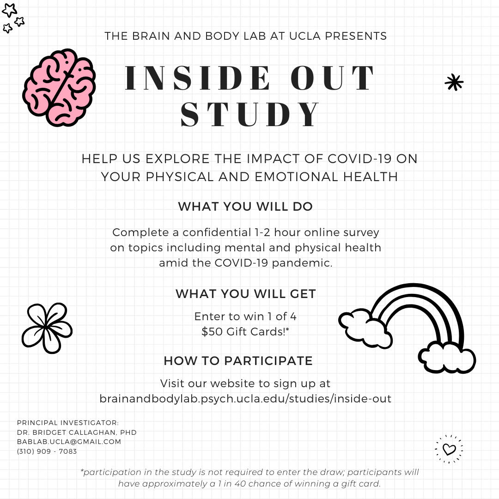

## Procedure

### Recruitment

Participants were recruited in two ways - via SONA and via a raffle.

The following materials were used:

### Timing

Pilot time:

- Research Assistant #1 - 1 hour and 50 minutes
- Research Assistant #2 - 1  hour and 15 minutes
- Research Assistant #3 - 1 hour and 5 minutes

### Questionnaire Order

1. panas (assessed 3 times - once at beginning, once before writing, once after writing)
2. information
3. somna
4. covid_objective
5. somatic_symptoms (assessed currently and retrospectively before COVID-19)
6. pss
7. hai (assessed currently and retrospectively before COVID-19)
8. bdi_ii (assessed currently and retrospectively before COVID-19)
9. pill
10. covid_subjective
11. pedsql_gi (assessed currently and retrospectively before COVID-19)
12. media_consumption
13. ctq
14. sci
15. psqi
16. cte
17. timeline
18. uclals
19. sasrq
20. ccfq
21. maia (assessed currently and retrospectively before COVID-19)
22. stai
23. usq
24. bfq (assessed currently and retrospectively before COVID-19)
25. asc
26. demographics
27. shs
28. mspss
29. ipaq (assessed currently and retrospectively before COVID-19)
30. ius
31. smcs
32. bfi 
33. ptgi_brcs
34. mental_health_history
35. med_check
36. gastro
37. rome
38. menstrual 
39. panas
40. written_response
41. panas

### Attention Checks

1. covid_objective
2. covid_subjective
3. media_consumption
4. scq 
5. sasrq 
6. bfq 
7. ipaq 
8. ptgi

