## Enrollment

### Sign Ups

All participants (even those on SONA) are instructed to sign-up via our website which includes filling out a form that submits an email to the BABLab Gmail account.

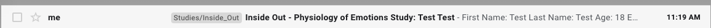
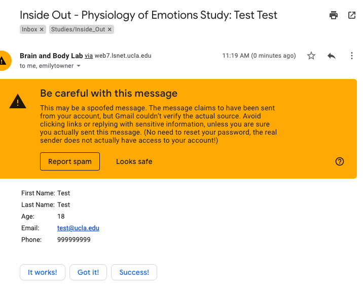

1. Add the participant to the ID spreadsheet on the ID Drive (make sure you are in the correct sheet for the version of the study)

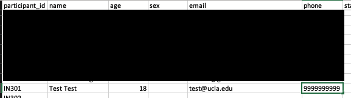

2. Compose an email from the "email_replies" template in BABLAB/Studies/Inside_Out/Private/Recruitment/email_replies.md (open this with TextEdit)

There are several current templates in here at all times to copy to an email. Copy and replace any brackets with the relevant information.

**Important**

Press reply and delete the two emails in the to field. Replace it with the correct email from the form.

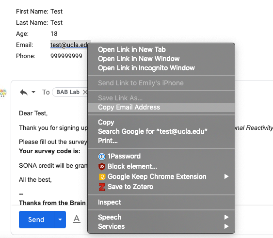

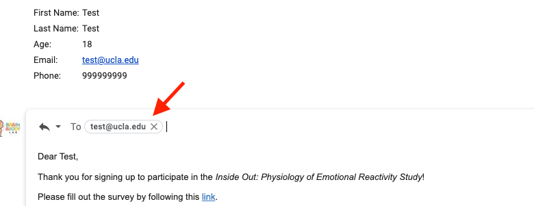

3. Generate a REDCap ID for that participant based on the spreadsheet

- In the REDCap project click Add/Edit Records

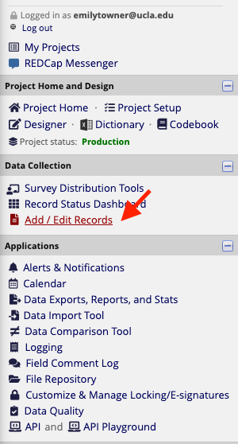

- Type in the corresponding new participant number and press enter

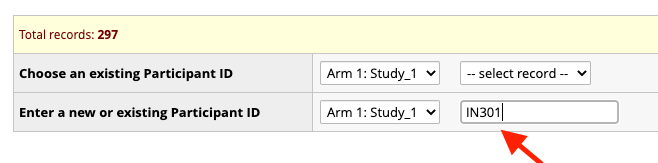

- Click into the participant instrument in the event you are running

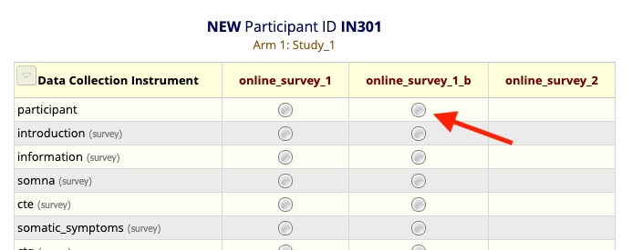

- Enter the wave and study number, complete, lock, save and exit form

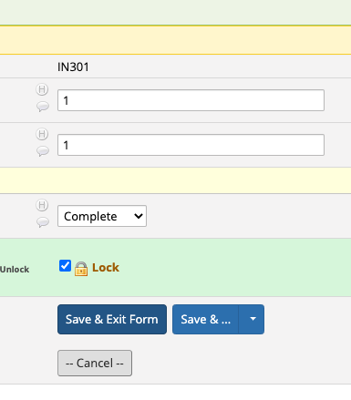

- Click into the first survey item

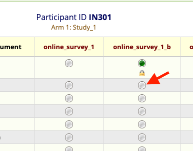

- Click into survey options and survey access code

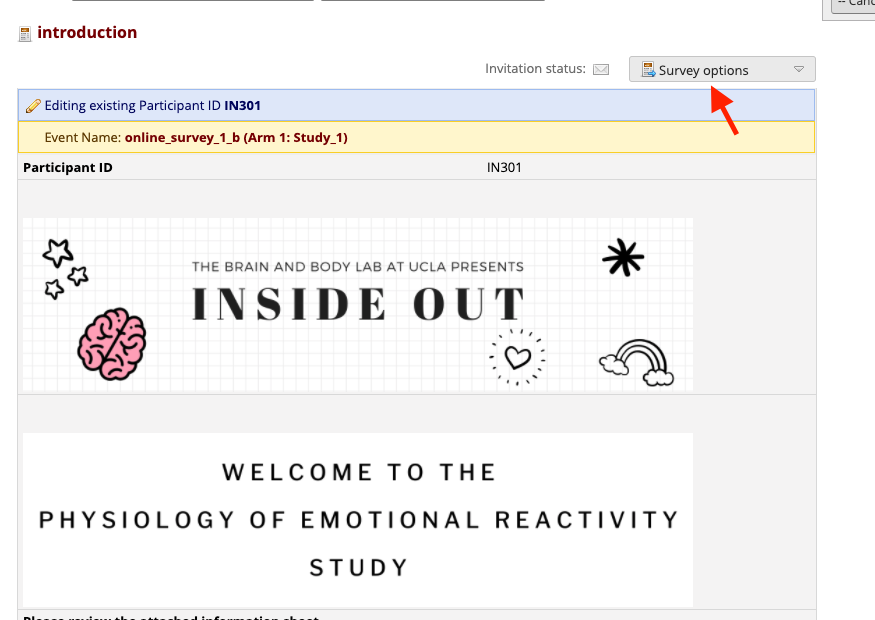

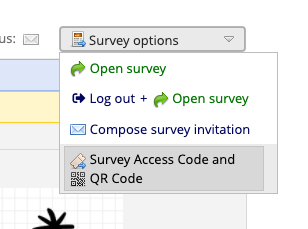

- Copy the survey access code, paste into the email, and send

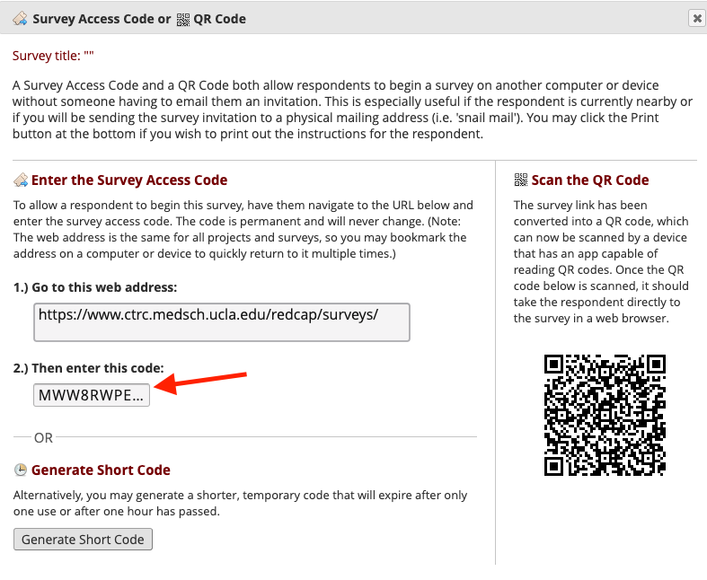

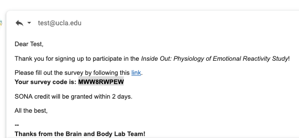

**Participants do not always use the correct email form on the website, and instead just sign up via SONA**

Therefore, we must cross-reference our SONA sign-ups with our ID spreadsheet.

1. Log into [SONA](https://ucla.sona-systems.com/Default.aspx?ReturnUrl=%2f)
2. Click "My Studies" and "Timeslots"
3. Click into your timeslot and cross reference the sign-ups with the ID spreadsheet

Add anyone who isn't there and enroll them using the same procedure as above - make sure to insert the correct subject line into the email.

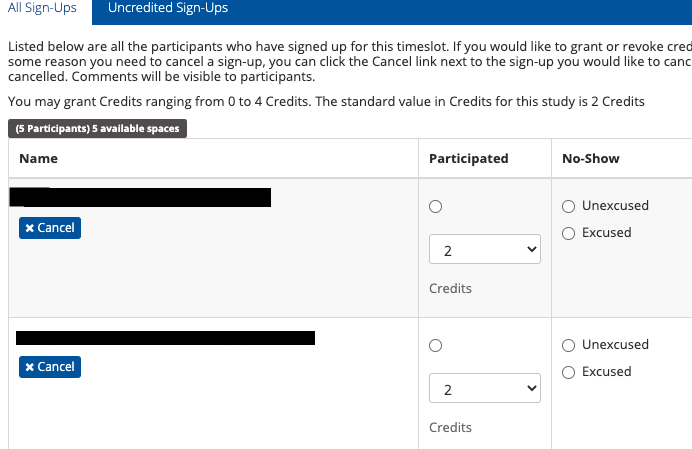

### Tracking

1. Mark the participant status on the ID spreadsheet as completed (green), in progress (yellow), not started (red), or duplicate/cancelled/mistake (dark red and strikethrough)
2. Send the participant 3 reminders (spread out across three days)

The reminder templates can be found in the email_replies.md

**Important** 

Each time you send a participant a reminder, you will need to ensure that their survey code and return code are correct. They can change each time a participant attempts to log in to the survey - so it is imperative to check before sending each reminder. 

Participants will always have a survey code, which can be found by clicking survey options. You must click into the most recently completed survey when sending a reminder (check the timestamp to be sure they are not mid-completion)

Some participants will also have a return code (yellow button) if they saved their place. Remember to send this code to them as well. 

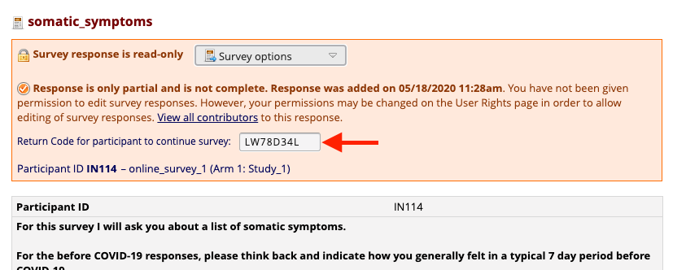

3. Mark each reminder as sent or na if completed/cancelled
4. Fill in age, sex, and recontact permission

### Granting Credit

1. Once participants have completed the survey - log on and grant credit via SONA